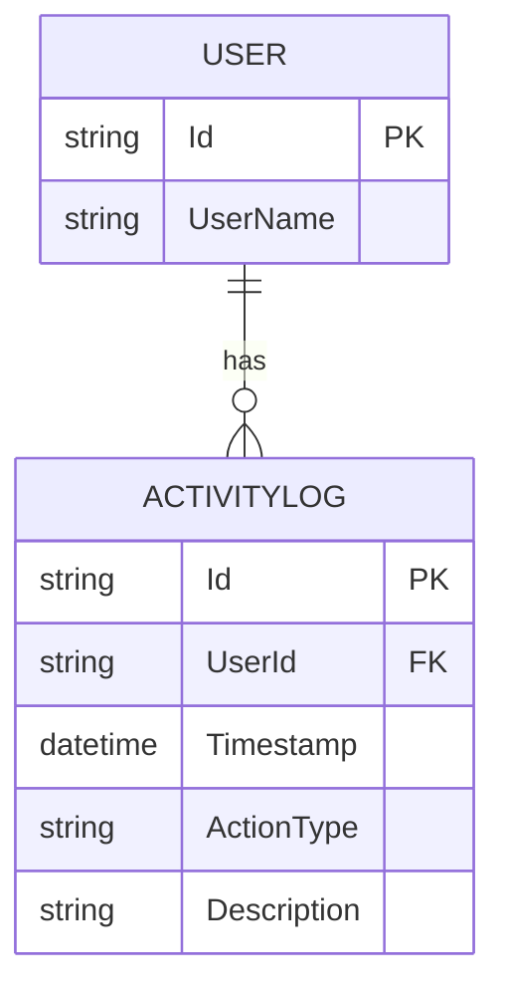

---

## 9. Implementation Considerations

- **Pagination**: Enforce maximum page size to prevent abuse.
- **Security**: Require authentication; restrict access to own logs unless admin.
- **Indexing**: Index `userId` and `timestamp` for efficient queries.
- **Extensibility**: Allow for future filters (e.g., by resource).

---

## 10. Traceability

- All requirements are mapped to API endpoints, DTOs, and database schema.
- Each log entry is traceable to a user and action.

---

**This document follows the Spec-Driven Workflow v1: all design, data flow, and interface details are explicit, testable, and traceable.**